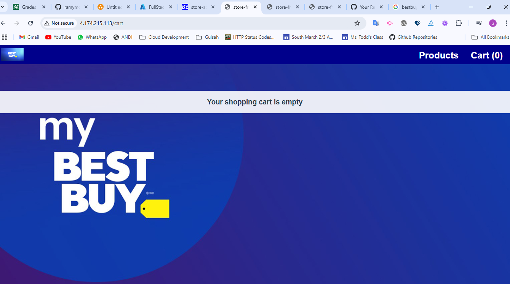
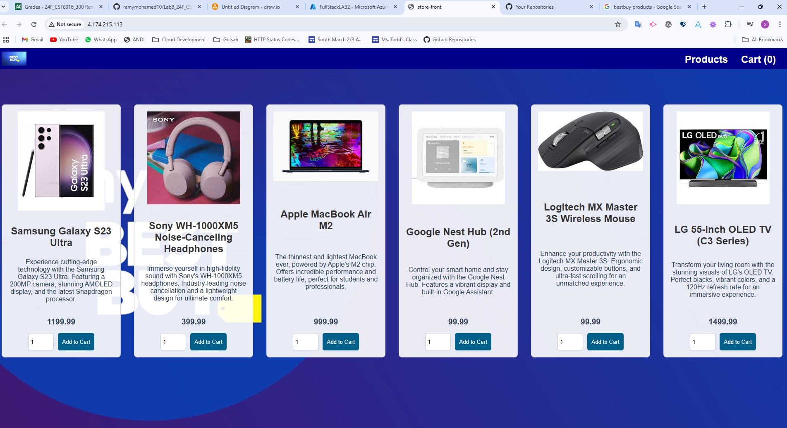
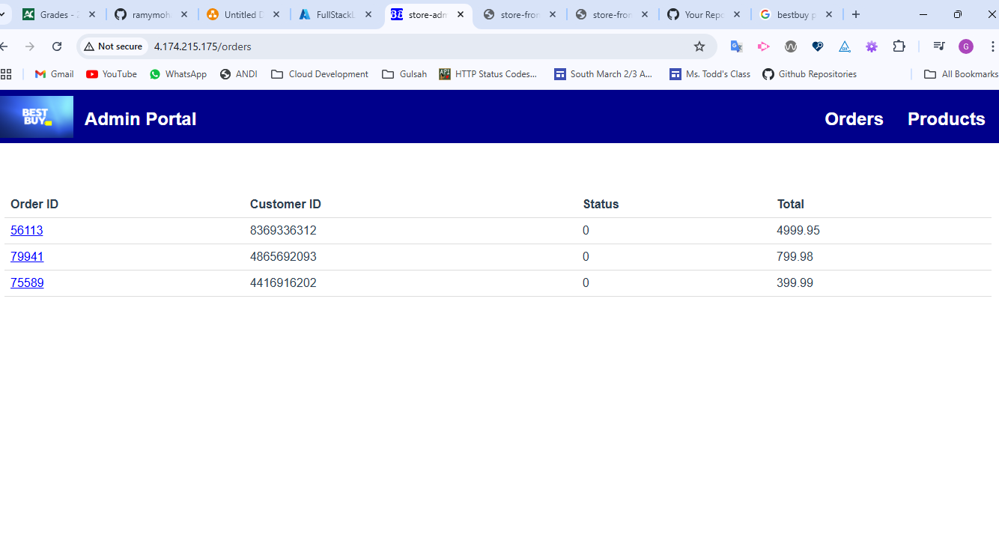
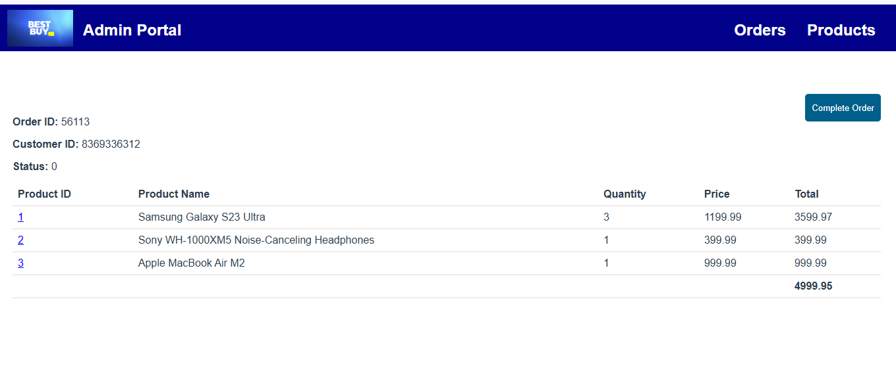
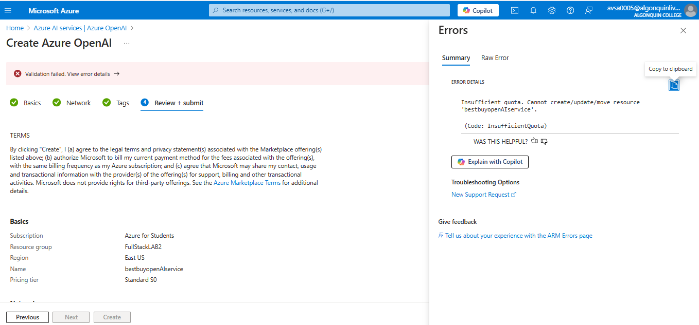

# Best Buy Cloud-Native Application
## Application Architecture


## Application and Architecture Explanation

### Architecture

This application is a cloud-native system for Best Buy that supports customer and employee interactions, order processing, inventory management, and AI-driven services.
Key users are customers and employees as shown in the diagram.

**store-front-best-buy** acts as the front-end for customers, allowing them to browse products, place orders, and interact with the system.

**store-admin-best-buy** enables employees to manage operations, such as inventory, product updates, and order fulfillment.

**order-service-best-buy** handles order placements by customers. Processes these orders and sends them to the Azure Service Bus, which queues them for further processing.

**product-service-best-buy** manages product information, such as inventory and availability. Interacts with MongoDB for data storage.

**makeline-service-best-buy** processes orders from employees and customers, ensuring order fulfillment and updates in the order database.

**ai-service-best-buy** uses AI capabilities to enhance customer and employee interactions. For example, the GPT-4 model powers intelligent responses, and the DALL-E model generates custom images.

### Information Flow

Customers interact with store-front-best-buy to browse and place orders.
Orders are processed by order-service-best-buy, which utilizes the Azure Service Bus for queuing.
Employees use store-admin-best-buy to manage operations like product updates and processing orders.
Product data is fetched and updated by product-service-best-buy with data stored in MongoDB.

## Deployment Instructions

### Step 1: best-buy-all-in-one.yaml

After updating all services, I pushed them to github separately. Then I build docker images and pushed them to docker desktop. I updated the best-buy-all-in-one.yaml with new docker images. 
This file takes place under Deployment files folder and includes all necessary Kubernetes resources.

### Step 2: Set up AKS Cluster

I created an AKS clusters with one worker node. 

Log in to Azure Portal.

Create a Resource Group called FullStackLAB2 in Canada region.

**Create an AKS Cluster**

In the Azure Portal, under Kubernetes services create and select Kubernetes cluster.

In the Basics tap fill in the following details:

* Subscription: Select your subscription.

* Resource group: Choose FullStackLAB2

* Cluster preset configuration: Choose Dev/Test.

* Kubernetes cluster name: BestBuyCluster

* Region: Same as your resource group (e.g., Canada)

* Availability zones: None

* AKS pricing tier: Free

* Kubernetes version: Default

* Automatic upgrade: Disabled

* Automatic upgrade scheduler: No schedule

* Node security channel type: None

* Security channel scheduler: No schedule

* Authentication and Authorization: Local accounts with Kubernetes RBAC

* In the Node pools tap fill in the following details

* Select agentpool. Optionally change its name to masterpool. This nodes will have the controlplane.

* Set node size to D2as_v4.

* Scale method: Manual

* Node count: 1

* Click update

* Click on Add node pool:

* Node pool name: workerspool.

* Mode: User

* Set node size to D2as_v4.

* Scale method: Manual

* Node count: 1

* Click add

* Click Review + Create, and then Create. The deployment will take a few minutes.

### Step 3: Connect to AKS Cluster via Visual Studio

Once the AKS cluster is deployed, navigate to the cluster in the Azure Portal.

In the overview page, click on Connect.

Select Azure CLI tap.

Login to your azure account using the following command:

```bash
az login
```

Set the cluster subscription using the command shown in the portal 

```bash
az account set --subscription 'subscription-id'
```

Copy the command shown in the portal for configuring kubectl

```bash
az aks get-credentials --resource-group FullStackLAB2 --name BestBuyCluster --overwrite-existing
```

Test your connection to the AKS cluster by listing all nodes:

```bash
kubectl get nodes
```

### Step 4: Set up AI Backing services

#### Create an Azure OpenAI Service Instance

In Azure Portal search for Azure OpenAI

Choose the East US region

Pricing tier: Standart

Review and Create

#### Deploy GPT-4 and DALL-E 3

Go to the OpenAI resource created

Deploy GPT-4:

* Go to the Model Deployments section and click Add Deployment

* Choose GPT-4 as the model and provide a deployment name

* Set the deployment configuration as required and deploy the model

Deploy DALL-E 3:

*Repeat the same process to deploy DALL-E 3.

Note Configuration Details:

Once deployed, note down the following details for each model:

**Deployment Name** and **Endpoint URL**

#### Update AI Service Deployment Configuration in the Deployment Files folder

* Modify Secretes YAML:

Edit the secrets.yaml file.

Replace OPENAI_API_KEY placeholder with the Base64-encoded value of the API_KEY.

* Modify Deployment YAML:

Edit the aps-all-in-one.yaml file.

Replace the placeholders with the configurations retrieved:

* AZURE_OPENAI_DEPLOYMENT_NAME: Enter the deployment name for GPT-4.

* AZURE_OPENAI_ENDPOINT: Enter the endpoint URL for the GPT-4 deployment.

* AZURE_OPENAI_DALLE_ENDPOINT: Enter the endpoint URL for the DALL-E 3 deployment.

* AZURE_OPENAI_DALLE_DEPLOYMENT_NAME: Enter the deployment name for DALL-E 3.

#### Deploy the ConfigMaps and Secrets
Deploy the ConfigMap for RabbitMQ Plugins:

```bash
kubectl apply -f config-maps.yaml
```

Create and Deploy the Secret for OpenAI API:

*Replace Base64-encoded-API-KEY in secrets.yaml with your Base64-encoded OpenAI API key.

```bash
kubectl apply -f secrets.yaml
```
#### Step 5: Deploy the Application

```bash
kubectl apply -f best-buy-all-in-one.yaml
```









## Table of Microservice Repositories

| Service               | Repository Link     |
|-----------------------|---------------------|
| Store-Front           | [store-front-best-buy](https://github.com/GulsahAvsar/store-front-best-buy.git)   |
| Order-Service         | [order-service-best-buy](https://github.com/GulsahAvsar/order-service-best-buy.git)   |
| Product-Service       | [product-service-best-buy](https://github.com/GulsahAvsar/product-service-best-buy.git)   |
| Store-Admin           | [store-admin-best-buy](https://github.com/GulsahAvsar/store-admin-best-buy.git)   |
| Makeline-Service      | [makeline-service-best-buy](https://github.com/GulsahAvsar/makeline-service-best-buy.git)   |
| AI-Service            | [ai-service-best-buy](https://github.com/GulsahAvsar/ai-service-best-buy.git)   |


## Table of Docker Images

| Service               | Docker Image Link                           |
|-----------------------|---------------------------------------------|
| Store-Front           | [gulsahavsar/store-front-best-buy](https://hub.docker.com/repository/docker/gulsahavsar/store-front-best-buy/general)                     |
| Order-Service         | [gulsahavsar/order-service-best-buy](https://hub.docker.com/repository/docker/gulsahavsar/order-service-best-buy/general)                     |
| Product-Service       | [gulsahavsar/product-service-best-buy](https://hub.docker.com/repository/docker/gulsahavsar/product-service-best-buy/general)                     |
| Store-Admin           | [gulsahavsar/store-admin-best-buy](https://hub.docker.com/repository/docker/gulsahavsar/store-admin-best-buy/general)                     |
| Makeline-Service      | [gulsahavsar/makeline-service-best-buy](https://hub.docker.com/repository/docker/gulsahavsar/makeline-service-best-buy/general)                     |
| AI-Service            | [gulsahavsar/ai-service-best-buy](https://hub.docker.com/repository/docker/gulsahavsar/ai-service-best-buy/general)                     |


## Any issues or limitations in the implementation

* When I deployed the application, first the ai-service didn't run. I replaced the docker image of aiservice with the previous one (Algonquinpetstore) and it worked.

* For the OpenAI service when I tried to deploy GPT-4 and DALL-E 3, I couldn't select the region East US. It was not available. For this reason, the endpoint and API Key was different.
 And unfortunately, the I couldn't get the generation of the text and image by AI for the products.

* I wanted to try for OPENAI once more to see it generates description and image for the products. When I tried 1 day later to create it, I got an error message saying that the quota is insufficient for creating an OpenAI service



* I couldn't implement managed backing service to the application

## Demo Video

https://youtu.be/vBcjRDcnn7U

## Bonus Task

I created ci/cd pipeline workflow for store-admin-best-buy
